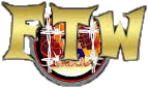
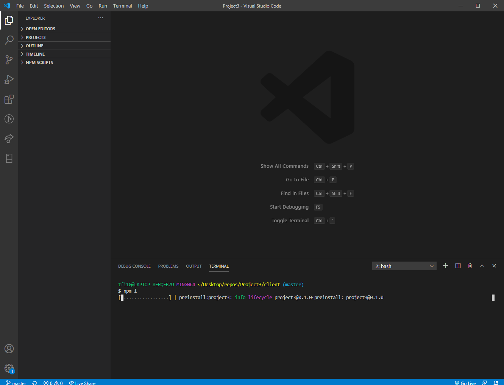
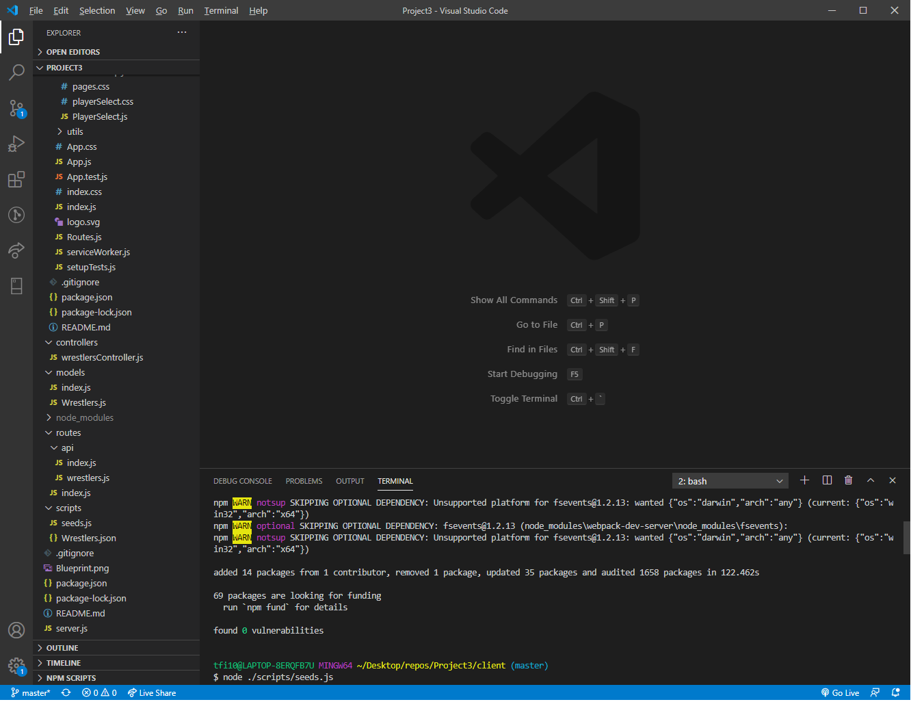
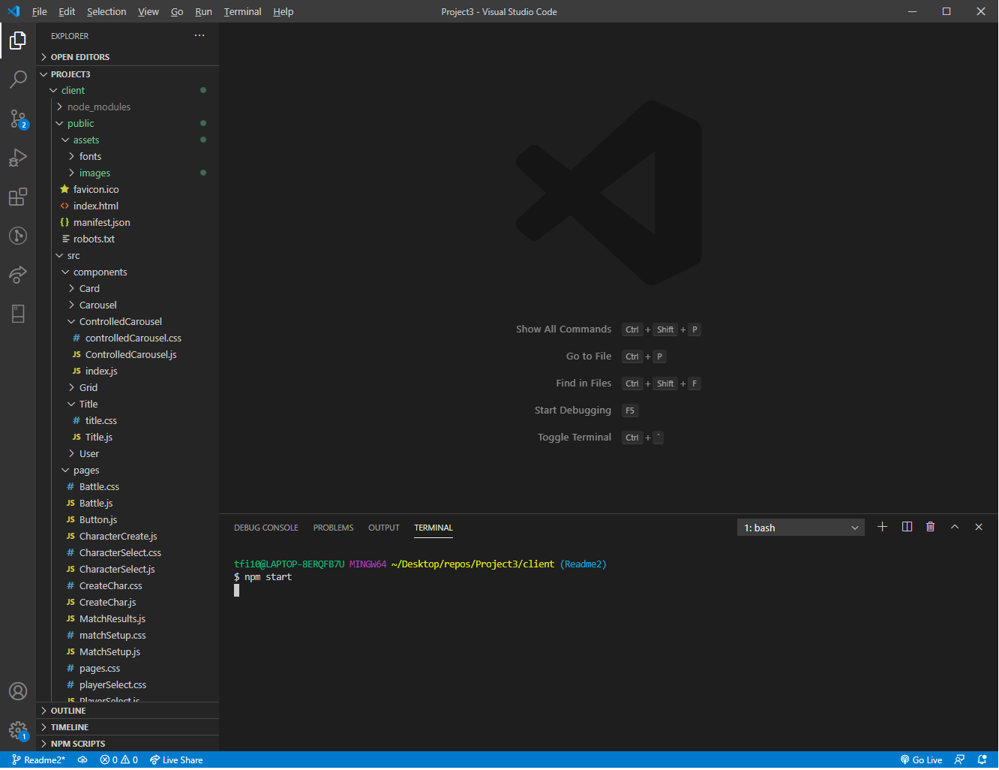
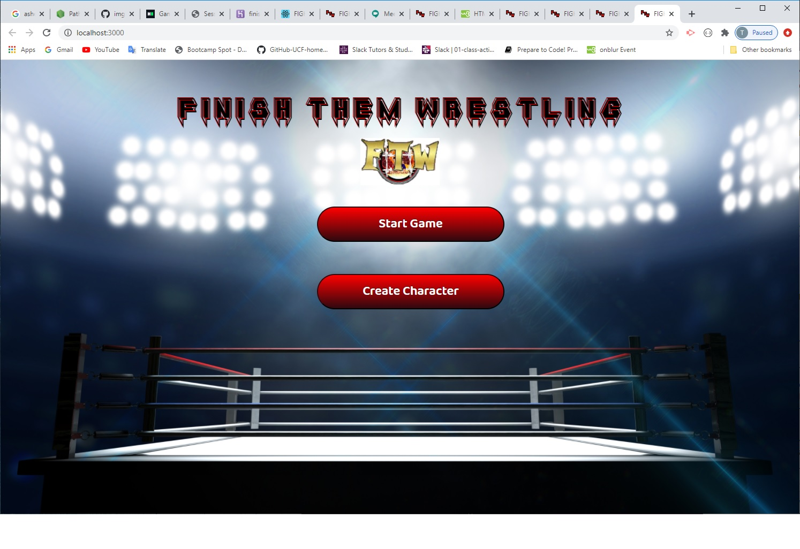
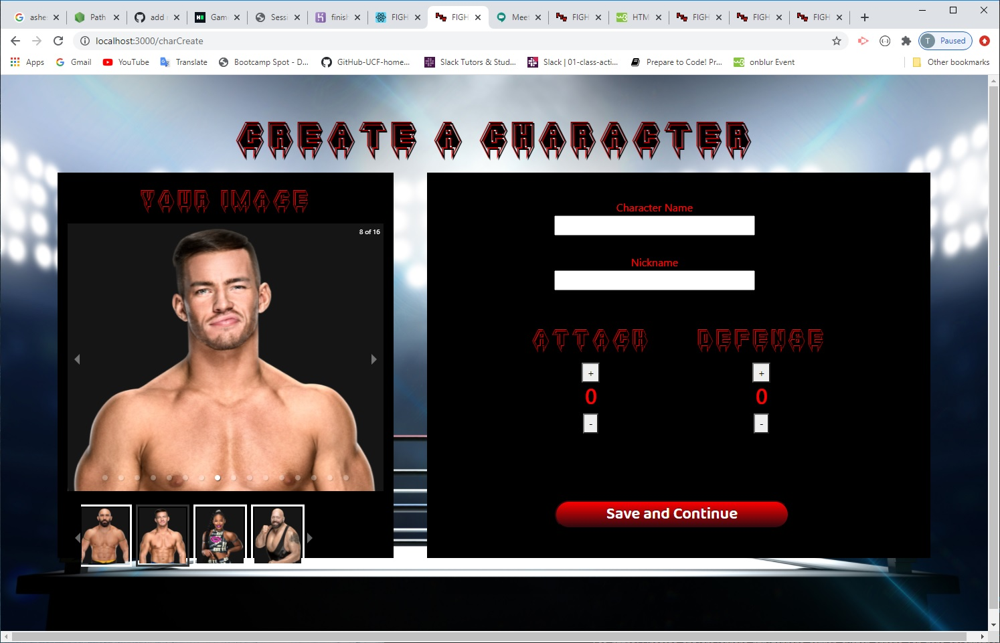
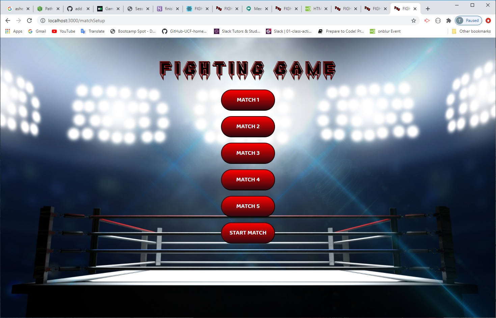
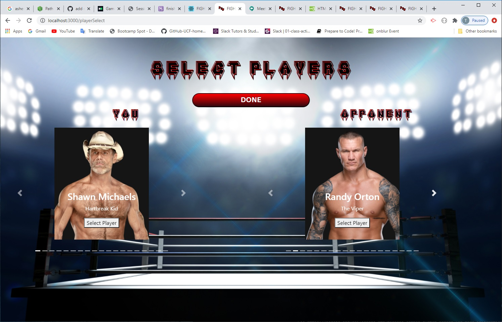
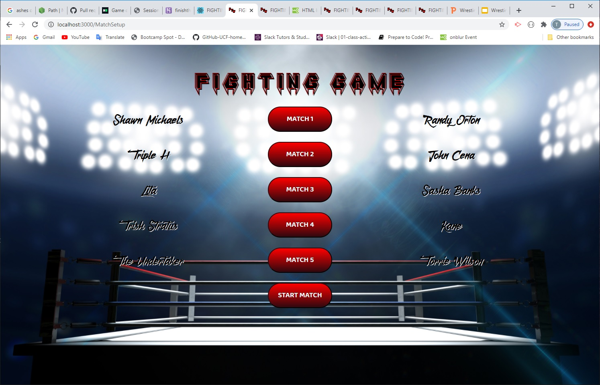
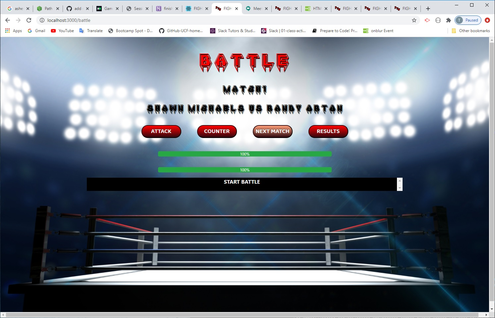

<a href="https://finishthemwrestling.herokuapp.com"></a>

<!-- [](https://finishthemwrestling.herokuapp.com) -->

# Project 3

>

This is a wrestling game where you can pick 1 to 5 matches and select each wrestler to fight in those matches.

### Clone

- Clone this repo to your local machine using `https://github.com/Code-Tim/Project3`

## Installation

> now install npm packages

```shell
- npm install
```



> Run this to seed the database first

```shell
- node ./scripts/seeds.js
```



> Run this to start the program

```shell
- npm start
```



---

## Features

> Create a character

> Match selection

---

## How to play

Click on the "Start Game" or "Create Character" button.


In the "Create a Character" page you will select a image, enter a name, and alocate at least 10 or more points in Attack and Defense. Once done click "save and continue"

On the "Match setup" screen, you will select "Match 1".

This will take you to the "Player Select" page where you will select your character (You) and the (Opponent) charecter. Once chosen click "Done"


Repeat this for the rest of the matches if you would like to play more then one match.
Click "Start Match"


On the "Battle" page you can click on "Attack" or "Counter" to play out the match. Once the meter reachs zero the match is over a winner will be made.

From here you can move on to the "Next Match" or see the "Results" of the matches.

## Team

- Copyright 2020 © <a href="[https://finishthemwrestling.herokuapp.com/](https://finishthemwrestling.herokuapp.com/)" target="_blank">FTW</a>.

<!-- > Written with [StackEdit](https://stackedit.io/). -->
